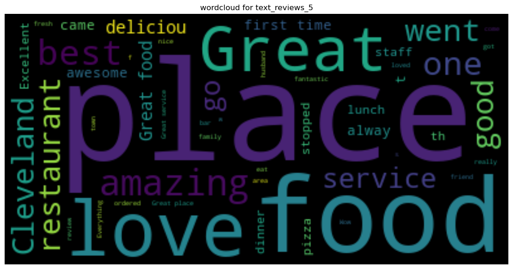

# Welcome to Reshma Rajan's Data Science Portfolio

🌟 Dive into my world of data-driven innovation, where complex challenges meet cutting-edge solutions. As a graduate student in Data Science at Middle Tennessee State University, I excel in transforming raw data into actionable insights with Python, SQL, and a suite of powerful analytics tools.

## 🎓 Educational Background

- **Master of Science (Data Science)** - Middle Tennessee State University, TN (In progress)
- **Master of Science (Structural Engineering)** - GPA 4.0, A P J Abdul Kalam Technological University, Kerala, India
- **Bachelor of Technology (Civil Engineering)** - GPA 3.85, Kerala, India

## 💻 Technical Expertise

- **Advanced Programming:** Proficient in Python, including libraries like SciPy and Matplotlib, and SQL for complex data operations.
- **Machine Learning & AI:** Skilled in TensorFlow, PyTorch, and Scikit-learn, creating models that predict, analyze, and infer with high accuracy.
- **Data Visualization & Analytics:** Expert in using Tableau and Power BI to craft insightful, interactive data visualizations.
- **Cloud & Big Data Technologies:** Experienced with AWS and Azure for scalable, efficient cloud data solutions.

## 🚀 Featured Projects

### 🏡 Predictive Analysis of Iowa Housing Prices
**Objective:** Forecast housing prices using a comprehensive dataset and advanced modeling in Python.
**Outcome:** Achieved remarkable accuracy, providing valuable insights into market trends and investment opportunities.
[Explore the Project](#)

### 🍴 NLP Restaurant Review Analysis
**Situation:** The project was designed to enhance restaurant recommendations by using the Yelp dataset, which included detailed restaurant profiles, user reviews, and user metadata. The challenge was to leverage this rich dataset to develop sophisticated recommender systems that could accurately reflect user preferences and current dining trends.
**Task:** The aim was to create advanced content-based and collaborative recommender systems. The content-based systems would employ Principal Component Analysis (PCA) and Singular Value Decomposition (SVD) to discern key restaurant features that influence user preferences. The collaborative system was intended to identify user patterns and preferences, especially focusing on similarities among patrons of popular dining spots like 'Ace Bar'.
**Action**: 
**Data Handling**: Utilized Jupyter Notebook for comprehensive data analysis and preprocessing. Tasks included data cleaning, merging datasets, transforming JSON-formatted data into analyzable columns, and focusing on relevant reviews from open restaurants post-2015.
**Content-Based Systems**: Implemented PCA to reduce dimensionality and identify crucial similarities in cuisine types and restaurant categories. SVD was also used to analyze and ascertain deeper attributes and categories that contribute to restaurant similarities.
**Collaborative System**: Developed a system based on analyzing user preferences for specific types of food, such as sandwiches, and comparing these to the preferences of users frequenting 'Ace Bar', thus creating a model that reflects real user choices and preferences.
**Result**
**Content-Based Systems**: Both PCA and SVD effectively pinpointed restaurants with similar offerings, with SVD showing higher similarity scores and excelling in identifying nuanced similarities across diverse cuisines, particularly Korean and other Asian foods.
**Collaborative System**: The system adeptly identified a variety of restaurants that aligned with the preferences of 'Ace Bar' patrons, confirming its capability to utilize user data for refining recommendations.
**Conclusion**: This project successfully demonstrated the potential of using sophisticated analytical techniques in recommender systems to provide targeted and effective restaurant suggestions. The integration of both content-based and collaborative approaches allowed for a nuanced understanding of user preferences and restaurant similarities, showcasing how rich datasets like Yelp's can be harnessed to enhance the accuracy and personalization of restaurant recommendations.

Link:https://github.com/IamReshmaR/Restaurant-Recommeder-System

### 📊 Employee Attrition Dashboard in Tableau
**Objective:** Analyze employee turnover data to identify and address key attrition drivers.
**Outcome:** Delivered actionable insights through a custom interactive dashboard, significantly aiding HR decision-making.
[Explore the Project](#)

## 🌐 Connect with Me

Interested in collaborating or learning more about my work? Let's connect!

- **Email:** [reshmarajan3590@gmail.com](mailto:reshmarajan3590@gmail.com)
- **LinkedIn:** [Reshma Rajan on LinkedIn](#)

Thank you for exploring my portfolio. Looking forward to making a significant impact together in the world of data science!
